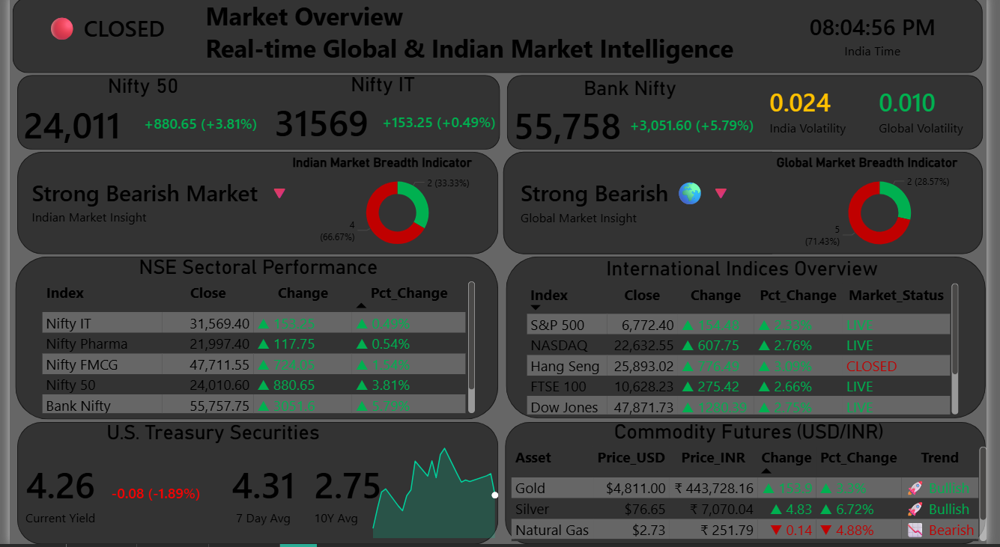
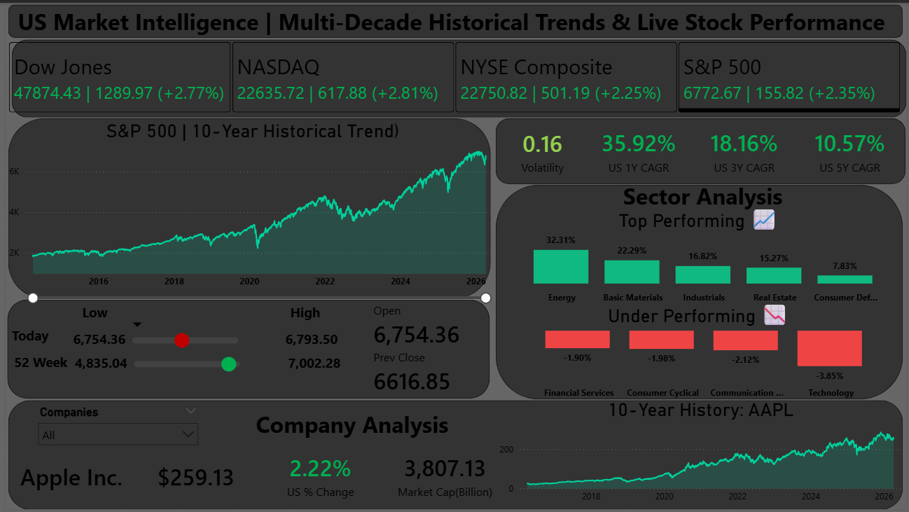

# 📈 Global Market Intelligence Terminal


## 📌 The "Why": Motivation Behind the Project
Most beginner data analytics portfolios rely on static, clean CSV files. In the real financial world, data is messy, delayed, and constantly changing. 

I built this terminal to bridge the gap between a standard BI dashboard and a live, professional-grade Fintech application. My goal was to prove my ability to handle **live API ingestion, data normalization across diverse sources, and complex DAX financial modeling** in a single, highly performant environment.

## 📸 Dashboard Previews

*(Note: Add your final screenshots here by dragging and dropping them into the GitHub editor)*
* **Page 1: Global Market Overview:** 
* **Page 2: NSE Index Tracker:** 
* **Page 3: US Market Intelligence:** 

---

## 📊 Core Architecture (3-Page Layout)

The dashboard is structured into three distinct analytical layers:

### 1. Market Overview (Global Macro Command Center)
Acts as the heartbeat of the global economy. 
* Tracks real-time status and performance of Global (S&P, Hang Seng) and Indian (Nifty, Bank Nifty) indices side-by-side.
* Calculates custom **Market Breadth Indicators** (Advancers vs. Decliners) to gauge true market sentiment.
* Integrates alternative asset classes: **U.S. Treasury Securities (10Y Yields)** and **Commodity Futures** (Gold, Silver, Natural Gas).

### 2. NSE Index Tracker
Dedicated view for Indian Equities.
* Granular performance tracking of top gainers, losers, and movers.
* eatures interactive 10-Year historical area charts for the Bank Nifty, Nifty 50 and Nifty IT.
* Company-level fundamental analysis including real-time **Market Cap (Cr)**, **P/B Ratios**, and intraday percentage changes.
  
### 3. US Market Intelligence
Deep-dive into the US Equity markets.
* Features interactive 10-Year historical area charts for the S&P 500, NASDAQ, Dow Jones and NYSE.
* Calculates proprietary risk/reward metrics: **Annualized Volatility** and **1Y, 3Y, 5Y CAGR**.
* **Dynamic Sector Analysis:** Automatically isolates and ranks the top-performing and underperforming sectors based on live intraday movements.

---

## 🚧 Engineering Challenges & Strategic Solutions

Building a live financial terminal introduced several real-world data engineering hurdles. Here is how I architected solutions for them:

### Challenge 1: API Rate Limiting & Fault Tolerance
**The Problem:** Fetching live 1-minute interval data for over 100+ global constituents simultaneously caused API rate limits (HTTP 429) and silent execution failures. In Power BI, if a Python script fails on a single row, the entire ETL pipeline crashes, resulting in a blank dashboard.
**The Solution:** I engineered the Python extraction script to be fully fault-tolerant. I implemented robust try/except blocks and strategic micro-delays (time.sleep()) to respect API limits. If a specific ticker fails to fetch or returns an empty DataFrame (e.g., due to a trading halt or holiday), the script gracefully skips the anomaly without breaking the primary data model load.

### Challenge 2: Index Pricing Logic (Price Return vs. Total Return)
**The Problem:** The Dow Jones 'Previous Close' showed a mathematical gap between my calculated `Change` and the reported API index levels.
**The Solution:** I identified the "Dividend Drop" effect—because the Dow is a price-weighted index, a constituent stock going ex-dividend distorts the opening price. I standardized my DAX logic to calculate an explicit **Price Return baseline** (`[LTP] - [Change]`), matching the exact physics of the exchange floor rather than relying on smoothed data.

### Challenge 3: Architecting a Dual-Grain Data Model
**The Problem:** Visualizing 10 years of historical daily data alongside 5 days of 1-minute intraday data creates a massive cardinality issue that can crash Power BI.
**The Solution:** I separated the data models in Python *before* ingestion. I built a `Index_Constituents` table for live snapshot metrics (CAGR, Volatility) and a flattened `History_10Y` table strictly for the area charts. I used `SELECTEDVALUE` and decoupled DAX measures to bridge the two tables, keeping the report incredibly fast without cross-filtering errors.

### Challenge 4: Cross-Market Timezone Normalization
**The Problem:** The terminal tracks both US (EST) and Indian (IST) markets simultaneously. Financial APIs return data stamped in their local exchange time. When imported into Power BI, aggregating mixed-timezone datetime data causes historical pricing to misalign (e.g., a US Friday close appearing on an Indian Saturday).
**The Solution:** I utilized Python's pandas library to intercept the datetime objects during the extraction phase. By applying timezone stripping logic (tz_localize(None)) and standardizing all historical arrays to a unified datetime format before they hit Power Query, I ensured seamless timeline continuity across all global charts.

---

## 🛠️ Tech Stack
**Technical Skills Demonstrated:**
* Data Pipeline Engineering: Live API ingestion (yfinance), data normalization, and timezone handling.
* Data Modeling (DAX): Row-context management, dynamic conditional formatting, and custom performance metrics.
* Data Visualization: UI/UX design, accessible contrast ratios, and interactive exploratory data analysis (EDA).
* ETL Processes: Using Python within Power Query to extract, transform, and load multi-grain data (intraday vs. 10-year historical).

**Domain/Analytical Skills Demonstrated:**
* Financial Modeling: Calculating Compound Annual Growth Rate (CAGR) and Annualized Volatility using log returns.
* Market Mechanics: Understanding Price-Weighted Indices (Dow Jones), Dividend Drop effects, and Market Capitalization discrepancies.
* Sentiment Analysis: Building and interpreting Market Breadth Indicators (Advancers vs. Decliners).
* **Data Extraction & Transformation:** Python (`pandas`, `numpy`, `yfinance`)
* **Data Modeling:** DAX (Data Analysis Expressions)

---
## 🧠 Key Takeaways & Learning Outcomes

Building this terminal was a massive step up from working with static datasets. Here are the top three lessons I took away from this project:

1. **Never Blindly Trust the API:** Just because an API returns a number doesn't mean it's the *right* number for your business logic. Finding the $100B market cap discrepancy taught me that a Data Analyst's real job is auditing and verifying the math behind the data, not just plotting it on a chart.
2. **Where to Compute (Python vs. DAX):** I initially tried to do all the math in Python, which made the dashboard rigid. I learned the architectural balance of using **Python for extraction and heavy transformations**, while leaving **DAX to handle dynamic, user-driven calculations** (like conditional formatting based on slicer selection).
3. **Designing for Cognitive Load:** I learned that a dashboard with 100+ data points can easily overwhelm a user. Implementing the "Trading Terminal" UI taught me the importance of WCAG contrast rules, whitespace management, and using dynamic text (smart titles) to guide the user's eye to the most critical insights instantly.
## ⚙️ How to Run This Project Locally

1. **Prerequisites:** Ensure you have [Power BI Desktop](https://powerbi.microsoft.com/desktop/) installed.
2. **Python Environment:** Install Python and the required libraries:
   ```bash
   pip install pandas numpy yfinance

## 👤 Author

**Amaan Khan** *Data Analyst*

Let's connect and talk about data!
* **LinkedIn:** www.linkedin.com/in/theamaan-khan
* **Email:** amaankhanamaan8@gmail.com
